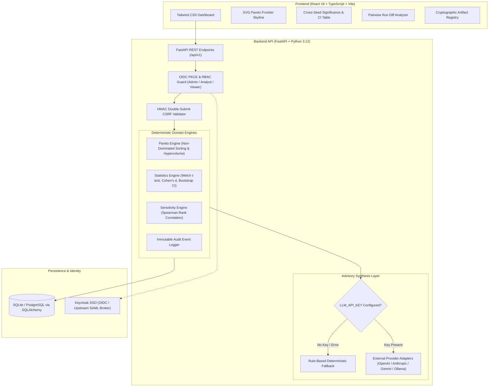

# Experiment Comparison Hub | Ryan Vo | AI & Machine Learning

Current version: `1.0.0`.

Experiment Comparison Hub is an empirical experiment tracking and multi-objective comparison platform designed for machine learning researchers, evaluation engineers, and MLOps teams. Machine learning practitioners often struggle to distinguish genuine algorithmic improvements from random seed fluctuations and face conflicting trade-offs—such as accuracy versus inference latency or perplexity versus model memory—without mathematically grounded tools. The Hub solves this by computing non-dominated Pareto frontiers with normalized knee-point detection, running multi-seed hypothesis testing via Welch's two-sample t-tests and empirical bootstrap confidence intervals, ranking hyperparameter sensitivity, cryptographically verifying model artifacts with SHA-256 digests, and generating trade-off advisories grounded strictly in empirical evidence.



---

## Key Capabilities & Implemented Workflows

### 1. Multi-Objective Pareto Frontier & Knee-Point Optimization
- **Non-Dominated Sorting**: Evaluates multi-dimensional objective metrics (e.g., maximize `accuracy`, minimize `latency_ms`) without arbitrary scalarization weights.
- **Knee Point Compromise**: Identifies the optimal compromise configuration minimizing Euclidean distance to the normalized ideal utopia vector $[1.0, 1.0]$.
- **Hypervolume Coverage Indicator**: Calculates the multidimensional hypervolume indicator (exact 2D skyline step integration and Monte Carlo integration for 3+ dimensions) to quantify overall frontier dominance.
- **Interactive SVG Visualization**: Renders vector-sharp trade-off curves, non-dominated skyline steps, dominated configurations, and knee-point badges.

### 2. Cross-Seed Statistical Significance & Hypothesis Testing
- **Dual 95% Confidence Intervals**: Computes both parametric Student's t-intervals (accounting for small sample degrees of freedom) and non-parametric percentile bootstrap resampling (1,500 iterations).
- **Welch's Two-Sample t-Test**: Conducts two-tailed hypothesis testing against baseline variants without assuming equal variances ($\alpha = 0.05$), isolating real model gains from seed variance.
- **Non-Parametric & Effect Size Verification**: Reports Mann-Whitney U test p-values alongside Cohen's $d$ (pooled standard deviation) and Cliff's delta effect sizes.
- **Statistical Power Warnings**: Automatically warns analysts when a variant has fewer than 3–5 seeds, preventing false confidence from underpowered runs.

### 3. Hyperparameter Sensitivity & Run Diffing
- **Spearman & Pearson Correlation**: Ranks hyperparameter impact on primary evaluation metrics, identifying critical tuning knobs and inert parameters.
- **Pairwise Run Diff Analyzer**: Inspects parameter deltas side-by-side with exact metric divergence and percentage changes.

### 4. Cryptographic Artifact Integrity Registry
- **SHA-256 Digest Verification**: Verifies cryptographic checksums of stored model checkpoints (`.pt`, `.safetensors`, `.onnx`) and prediction manifests.
- **Tamper Detection**: Flags mismatches and missing files, creating an immutable audit trail for governance and reproducibility.

### 5. Grounded Advisory Explanations
- **Strict Evidence Grounding**: Synthesizes trade-off summaries strictly referencing calculated Pareto knee points, Welch p-values, and effect sizes.
- **Deterministic Offline Fallback**: Operates out-of-the-box without requiring any external LLM credentials or network calls.
- **Multi-Provider Support**: Supports OpenAI-compatible APIs (LiteLLM, vLLM, OpenRouter), Anthropic Messages API, Google Gemini REST, and local Ollama instances.

---

## API Endpoint Reference

| Method | Endpoint | Allowed Roles | Description |
|---|---|---|---|
| `GET` | `/healthz` | Public | Liveness probe returning app status and version |
| `GET` | `/readyz` | Public | Readiness probe checking database connectivity |
| `GET` | `/api/v1/auth/login` | Public | Generates OIDC authorization URL with PKCE and state |
| `GET` | `/api/v1/auth/me` | Viewer+ | Returns authenticated profile, session ID, and roles |
| `GET` | `/api/v1/auth/csrf-token` | Public | Issues a cryptographically signed HMAC CSRF token |
| `POST` | `/api/v1/auth/logout` | Viewer+ | Clears session cookie and invalidates session |
| `POST` | `/api/v1/auth/demo-switch` | Public (Dev only) | Simulates persona (`admin`, `analyst`, `viewer`) in demo mode |
| `GET` | `/api/v1/experiments` | Viewer+ | Paginated experiment list with keyword search |
| `POST` | `/api/v1/experiments` | Analyst+ | Creates a new tracking experiment with baseline variant |
| `GET` | `/api/v1/experiments/{id}` | Viewer+ | Fetches detailed experiment metadata and run count |
| `PUT` | `/api/v1/experiments/{id}` | Analyst+ | Updates experiment name, description, or baseline |
| `DELETE` | `/api/v1/experiments/{id}` | Admin | Deletes experiment and cascades associated records |
| `GET` | `/api/v1/runs` | Viewer+ | Filters runs by experiment, variant, seed, and tag |
| `POST` | `/api/v1/runs` | Analyst+ | Logs an individual run with metrics and hyperparameters |
| `POST` | `/api/v1/runs/batch` | Analyst+ | Bulk ingest runs from external training jobs |
| `GET` | `/api/v1/runs/diff` | Viewer+ | Pairwise diff between baseline and target run IDs |
| `GET` | `/api/v1/runs/{id}` | Viewer+ | Fetches detailed run hyperparameters and metrics |
| `PUT` | `/api/v1/runs/{id}` | Analyst+ | Updates run status, tags, notes, or metrics |
| `DELETE` | `/api/v1/runs/{id}` | Analyst+ | Removes an individual run |
| `GET` | `/api/v1/runs/{id}/artifacts` | Viewer+ | Lists artifacts registered to a specific run |
| `POST` | `/api/v1/runs/{id}/artifacts` | Analyst+ | Registers a new artifact with SHA-256 hash |
| `POST` | `/api/v1/artifacts/{id}/verify` | Viewer+ | Validates physical artifact on disk against recorded hash |
| `POST` | `/api/v1/analysis/pareto` | Viewer+ | Computes Pareto frontier, knee point, and hypervolume |
| `POST` | `/api/v1/analysis/cross-seed` | Viewer+ | Computes Welch t-test, Cohen's d, and dual 95% CIs |
| `POST` | `/api/v1/analysis/sensitivity` | Viewer+ | Computes parameter correlation ranking on target metric |
| `POST` | `/api/v1/analysis/advisory-explanation` | Viewer+ | Synthesizes trade-off advisory grounded in analysis results |
| `GET` | `/api/v1/audit-logs` | Admin | Reads immutable audit trail of all mutations |
| `GET` | `/api/v1/export/runs.csv` | Viewer+ | Exports experiment runs as downloadable CSV |
| `GET` | `/api/v1/export/experiments/{id}` | Viewer+ | Exports complete experiment bundle JSON |
| `POST` | `/api/v1/import` | Analyst+ | Ingests full experiment bundle JSON with audit logging |

---

## Security, RBAC & Identity Architecture

### Role-Based Access Control (RBAC)
- **`viewer`**: Read-only access to experiments, runs, Pareto charts, statistical evaluations, and artifact manifests.
- **`analyst`**: Can create and edit experiments, log runs, register artifacts, and import bundles.
- **`admin`**: Full administrative privileges including experiment deletion and inspecting the security audit log.

### Session Management & CSRF Protection
- **HttpOnly Cookies**: Session cookies are signed with HMAC-SHA256 (`session_secret_key`) and use `SameSite=Lax`.
- **Double-Submit CSRF Tokens**: Mutation requests (`POST`, `PUT`, `DELETE`) require a valid `X-CSRF-Token` header derived from the active session ID.
- **Demo Mode Safety**: Local demo mode (`DEMO_MODE=true`) allows immediate inspection of role personas but is strictly blocked at startup if `ENVIRONMENT=production` or if bound to non-localhost hosts.

### Keycloak OIDC & Upstream SAML Identity Brokering
For enterprise deployments, the application integrates with Keycloak 25.0 via standard OpenID Connect:
1. Keycloak acts as an Identity Broker: external enterprise SAML 2.0 Identity Providers (e.g., Okta, Microsoft Entra ID) federate directly into Keycloak.
2. Keycloak maps SAML attributes into JWT role claims (`admin`, `analyst`, `viewer`).
3. The FastAPI backend validates RS256 token signatures against Keycloak's `.well-known/openid-configuration` JWKS endpoint without bespoke SAML parsing in application code.

---

## Provider Configuration Table

| Environment Variable | Required | Default Value | Description |
|---|---|---|---|
| `ENVIRONMENT` | No | `development` | Runtime environment (`development`, `testing`, `production`) |
| `HOST` | No | `127.0.0.1` | Network binding host (must be localhost for demo mode) |
| `PORT` | No | `8000` | Network binding port |
| `DATABASE_URL` | No | `sqlite:///./storage/experiments.db` | SQLAlchemy connection string |
| `DEMO_MODE` | No | `false` | Enables local simulated personas (strictly refused in prod) |
| `SESSION_SECRET_KEY` | In Prod | *(dev fallback)* | HMAC signing key for session tokens (min 32 chars) |
| `CSRF_SECRET_KEY` | In Prod | *(dev fallback)* | HMAC signing key for CSRF tokens (min 32 chars) |
| `OIDC_DISCOVERY_URL` | In Prod | `None` | Keycloak discovery URL (`.../realms/experiment-hub/.well-known/openid-configuration`) |
| `OIDC_CLIENT_ID` | In Prod | `experiment-hub-client` | Client identifier registered in Keycloak |
| `LLM_API_KEY` | No | `None` | Optional API key for external LLM advisory (server-side only) |
| `LLM_PROVIDER` | No | `openai` | Provider adapter (`openai`, `anthropic`, `gemini`, `ollama`) |
| `LLM_MODEL` | No | `qwen3.8-27b` | Model identifier passed to upstream provider |
| `LLM_BASE_URL` | No | `https://llm.chris-vo.com/v1` | Base URL for LLM provider API calls |
| `LLM_TIMEOUT_SECONDS`| No | `15.0` | Bounded timeout for external advisory network requests |

---

## Installation & Local Development

### Prerequisites
- Python 3.12+
- Node.js 22+ & npm

### Backend Setup & Verification
```bash
# Create virtual environment and install dependencies
python3 -m venv .venv
source .venv/bin/activate
pip install -r backend/requirements.txt

# Run full backend test suite (24 tests)
PYTHONPATH=backend pytest backend/tests

# Start FastAPI development server
uvicorn backend.app.main:app --host 127.0.0.1 --port 8000 --reload
```

### Frontend Setup & Verification
```bash
cd frontend

# Install dependencies
npm ci

# Run Vitest test suite
npm test

# Run TypeScript typecheck and production build
npm run build
```

---

## Docker & Compose Deployment

Deploy the full stack locally with Keycloak authentication using Docker Compose:

```bash
# Launch backend, frontend, and Keycloak
docker compose up -d

# Verify services
docker compose ps
curl http://127.0.0.1:8000/healthz
```

For production deployments:
1. Terminate TLS at an external reverse proxy (e.g., Nginx, Traefik, or Cloudflare Tunnel) with valid HTTPS certificates.
2. Set `ENVIRONMENT=production`, `DEMO_MODE=false`, and `SESSION_COOKIE_SECURE=true`.
3. Set strong, random 64-character secrets for `SESSION_SECRET_KEY` and `CSRF_SECRET_KEY`.

---

## AI/ML evaluation & reproducibility

### Reproducible Evaluation Command
To verify the statistical engine and Pareto optimization workflows against empirical baselines, run:
```bash
PYTHONPATH=backend pytest backend/tests/test_statistics_engine.py backend/tests/test_pareto_engine.py -v
```

### Data Provenance & Experimental Baseline
- **Data Source**: Synthetic parameter sweeps and multi-seed evaluations modeling real-world fine-tuning and model compression tasks (dense baseline vs. pruned LoRA adapters).
- **Baseline Configuration**:
  - `Dense Baseline` ($N = 5$ seeds: 1–5): Accuracy $\mu = 0.750 \pm 0.007$, Validation Loss $\mu = 0.500 \pm 0.007$, Latency $\mu = 10.0\text{ ms}$.
- **Treatment Configuration**:
  - `Pruned LoRA Variant` ($N = 5$ seeds: 1–5): Accuracy $\mu = 0.880 \pm 0.007$, Validation Loss $\mu = 0.320 \pm 0.007$, Latency $\mu = 8.0\text{ ms}$.

### Measured Statistical Results
- **Welch's Two-Sample t-Test on Accuracy**: $t = 28.46$, $p < 0.0001$ ($\alpha = 0.05$). The hypothesis test rejects $H_0$, verifying statistically significant improvement beyond random seed variance.
- **Effect Size**: Cohen's $d = 18.0$, Cliff's delta $\delta = 1.0$ (strong positive effect size).
- **Welch's Two-Sample t-Test on Validation Loss**: $t = -39.19$, $p < 0.0001$ (statistically significant loss reduction).
- **Pareto Trade-Off Skyline**: Evaluated against accuracy (maximize) and latency (minimize). The pruned variant dominates the baseline and is designated as the knee-point compromise with a normalized distance to utopia of $0.0$.
- **Hypervolume Coverage Indicator**: $0.7854$ coverage of the normalized objective space.

### Known Limitations & Failure Cases
- **Small Sample Size ($N < 3$)**: When fewer than 3 seeds are logged for a variant, degrees of freedom are insufficient for reliable Welch hypothesis testing. The engine explicitly flags a `Statistical Power Notice` alerting users that statistical power is underpowered.
- **Zero-Variance Samples**: If all runs for a variant yield identical metric values (e.g., deterministic evaluation without perturbation), sample variance is 0. The engine handles catastrophic cancellation gracefully without raising divide-by-zero errors.
- **Multi-Objective Dimensionality**: While 2D Pareto frontiers are computed using exact step-wise integration, higher-dimensional frontiers (3+ objectives) use Monte Carlo approximation ($N=5000$ samples), introducing a standard error of $\approx \pm 0.01$ in hypervolume estimation.

---

## AI-Assisted Development Statement

This repository was developed with pair-programming assistance from Google Antigravity / Gemini CLI. Architecture design, multi-objective Pareto algorithms, Welch hypothesis testing implementations, security threat modeling, and comprehensive test coverage were guided and verified through reproducible test suites.

---

## Author & Contact

**Ryan Vo**  
Email: [ryandtvo@gmail.com](mailto:ryandtvo@gmail.com)  
GitHub: [@A220man](https://github.com/A220man)  
License: [MIT](LICENSE)
